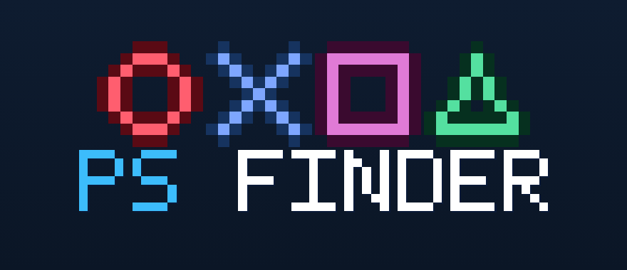

# PS Finder - PlayStation game recommender

**Live app: https://orarr2.github.io/IGDB-PS-Finder/**

<p align="center">
  
</p>

Tell it a PlayStation game you love and get real recommendations - ranked by
metadata (**Smart**), by how the gameplay actually *looks* using computer vision
(**Looks alike**), or surfaced as under-the-radar **Hidden gems**. You can also
search by a screenshot, browse **Upcoming** releases, and keep a **My List**.
It covers 7,000+ PS1-PS5 titles from the [IGDB API](https://api-docs.igdb.com/),
served from a Supabase Postgres database.

## Install on iPhone / iPad

PS Finder is a Progressive Web App, so there's no App Store, no Mac and no Xcode:

1. Open the **live app** link above in **Safari** (it has to be Safari on iOS).
2. Tap the **Share** button (the square with an up-arrow, at the bottom of the screen).
3. Scroll down the share sheet and tap **Add to Home Screen**.
4. Tap **Add** (top right).

It now sits on your Home Screen with its own icon and opens full-screen, like a
native app. On **Android**, open the link in Chrome, then use the menu and tap
**Install app** / **Add to Home screen**.

## What it does

- **Three recommendation modes** - Smart (metadata: genres, themes, studio,
  series), Looks alike (computer vision on real gameplay screenshots), and
  Hidden gems (highly rated but obscure).
- **Search by a photo** - upload a screenshot and it finds games that look like
  it, running fully on your device.
- **Upcoming** - the most anticipated titles plus everything releasing in the
  next three months.
- **My List**, cover art, ratings, a screenshot gallery, and one-tap share.

The web/iOS app lives in [`docs/`](docs/) and is served via GitHub Pages. A
PyQt6 desktop version and the data pipeline are also in this repo (below).

## What's in the repo

| Path | Purpose |
|---|---|
| `docs/` | Web/iOS PWA (the live app, served via GitHub Pages) |
| `desktop_app/` | PyQt6 desktop app + IGDB data pipeline (see [`desktop_app/README.md`](desktop_app/README.md)) |
| `ml/` | Visual-similarity pipeline (CLIP embeddings, neighbours, ONNX export) |
| `migrations/` | Supabase SQL migrations |
| `android/` | TWA manifest for the Android APK build |
| `.github/workflows/` | CI: dataset refresh, embedding builds, Pages deploy, APK build |
| `.env.example` | Required environment variables |

## How recommendations work

`get_recommendations(source_id)` is a Postgres function that scores every other
game against the one you picked. The score blends curated similarity with tag
overlap and quality:

- **+1000** if the candidate appears in IGDB's curated `similar_games` for the
  source
- **+15** per shared developer
- **+10** per shared genre
- **+5** per shared theme
- **+3** per shared `game_mode`
- **+ rating/20** mild quality boost

Top-9 by score wins. Results are produced server-side in one round-trip.

## Setup

### 1. Supabase project

1. Create a Supabase project (any region).
2. Apply the migrations in `migrations/` (schema is one `games` table plus the
   `search_games` and `get_recommendations` RPC functions).
3. From **Project Settings → API Keys**, copy:
   - `URL` → `SUPABASE_URL`
   - `service_role` key → `SUPABASE_SERVICE_KEY` (for the one-time load, never
     ship to clients)
   - `anon` / `publishable` key → `SUPABASE_ANON_KEY` (used by the app)

### 2. Twitch developer app (for IGDB)

Register an app at https://dev.twitch.tv/console/apps. Copy the Client ID and
Client Secret into your `.env`.

### 3. Local config

```bash
cp .env.example .env
# fill in the four/five values
```

### 4. Load the dataset (one time)

```bash
pip install requests pandas tqdm pyarrow supabase PyQt6
python desktop_app/collect_igdb.py        # ~20 seconds, writes igdb_dataset/data/games.parquet
python desktop_app/load_to_supabase.py    # ~10 seconds, upserts the rows
```

### 5. Run the desktop app

```bash
python desktop_app/app.py
```

Or double-click **`desktop_app/Launch Recommender.bat`** on Windows - it
installs deps and loads `.env` automatically.

## Building a standalone `.exe`

See [`desktop_app/BUILD_EXE.md`](desktop_app/BUILD_EXE.md).

## Notes

- **Images are not stored in the DB.** Covers and screenshots are served from
  IGDB's CDN at `https://images.igdb.com/igdb/image/upload/t_<size>/<image_id>.jpg`.
  The DB only stores the `image_id`. This keeps the dataset under 100 MB.
- **Row-Level Security is on.** The `games` table allows anonymous reads (so
  the publishable key works in the client) but blocks writes from anyone except
  the service-role.
- **The recommendation engine is SQL-based**, not the gradient-boosting model
  the repo name hints at. That model is a planned next step - bring your own
  CNN on the cover images.
- **IGDB API change:** the old `category = 0` filter (main games) no longer
  works; the field was renamed `game_type`. `desktop_app/collect_igdb.py`
  already uses the new name. If you reuse the notebook, patch that line first.
